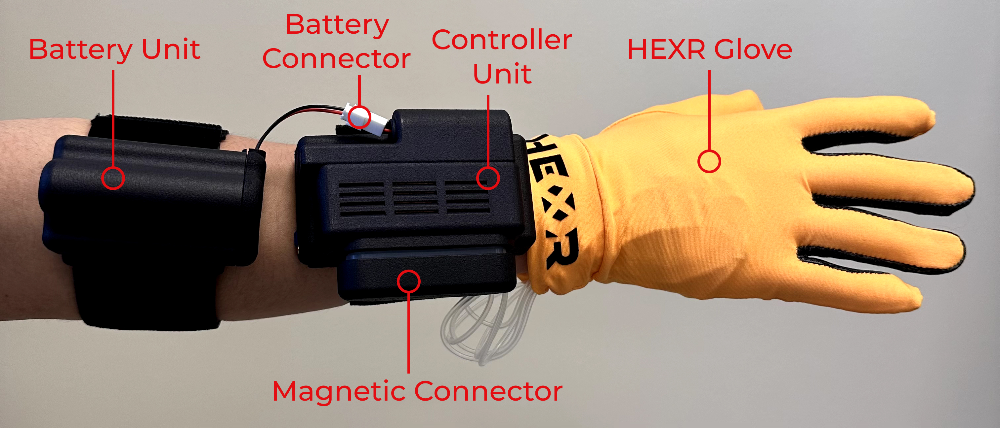

## This project is an example project testing the serial communication of the HEXR glove with the PICO headset.

### Instructions on wearing the glove and turning it on (Check the image below to see how it looks like).

1. Wear the battery unit and tighten the velcro strap.
2. Wear the control unit and tighten the velcro strap.
3. Connect the battery to the controller unit.
4. Wear the glove/s and and push the glove inwards so that the fingertips reach the ends.
5. Connect the magnetic connector to the controller unit and push it in.
6. Push the button down to turn the glove on.

### Instructions on removal of the glove and turning it off.

1. Disconnect the magnetic connector from the controller unit and take the glove/s out.
2. Loosen the velcro straps and slip your hand/s out.
3. Push down the button until you see the green light go out.
4. Unplug the battery.
5. Prepare for charging, if needed.

### Instructions to use the app with the glove

Once you have deployed the apk to the PICO headset, you are ready to pair the HEXR glove. Follow the instructions above
to turn on the glove. After that, start the app you just deployed to the headset. Once ready, connect the glove with 
the headset using a USB Type-C to C. As soon you connect the glove, you might be requested to enable permissions for the 
glove to interact with your device. To that, please check allow.

Finally, the current iteration of the app expects that the glove will remain connected. If for some reason, the glove is 
disconnected, **please restart the app and connect the glove again.**

Happy experimenting!

本例程项目是用于 HEXR 手套与 PICO 头显的串行通信。
佩戴手套及开机的操作说明（请参照下方图片了解手套外观）：
戴上电池单元（battery unit）并拉紧魔术贴带。
戴上控制单元（controller unit）并拉紧魔术贴带。
将电池连接到控制单元。
戴上手套，使指尖到达手套的末端。
将磁性连接器（magnetic connector）靠近控制单元上的接口，并按入。
轻轻向下滑动按钮以开启手套。

摘下手套和关闭设备的操作说明：
将磁性连接器先从控制单元上拔下，然后取下手套。
松开魔术贴环带，将手从魔术贴环带中抽出。
滑动按住按钮一秒钟，直到绿灯熄灭。
如有需要，拔掉电池连接，使用电池充电器为电池充电。
4. If needed, unplug the battery and use the battery charger to charge the battery.
   使用手套与应用程序的操作说明：
   将 APK 部署到 PICO 头显后，按照上面的说明开启手套。然后，启动刚刚部署到头显上的应用程序。准备就绪后，用 USB Type-C线将手套连接到头显。连接手套后，可能会弹出请求权限以允许手套与设备交互的提示，请选择“允许”。
   当前版本的应用程序要求手套保持连接状态。如果USB Type-C线中途拔出而导致手套与头显断开连接，请重新启动应用程序并重新连接手套。