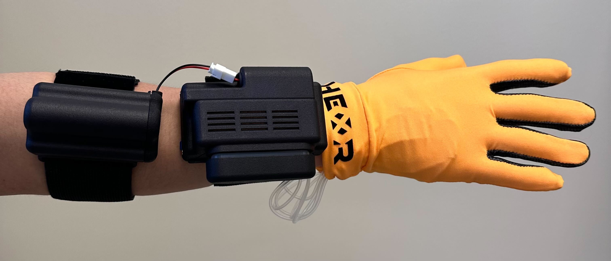

## This project is an example project testing the serial communication of the HEXR glove with the PICO headset.

### Instructions on wearing the glove and turning it on (Check the image below to see how it looks like).

1. Wear the battery unit and tighten the velcro strap.
2. Wear the control unit and tighten the velcro strap.
3. Connect the battery to the controller unit.
4. Wear the glove/s and and push the glove inwards so that the fingertips reach the ends.
5. Connect the magnetic connector to the controller unit and push it in.
6. Push the button down to turn the glove on.

### Instructions on removal of the glove and turning it off.

1. Disconnect the magnetic connector from the controller unit and take the glove/s out.
2. Loosen the velcro straps and slip your hand/s out.
3. Push down the button until you see the green light go out.
4. Unplug the battery.
5. Prepare for charging, if needed.

### Instructions to use the app with the glove

Once you have deployed the apk to the PICO headset, you are ready to pair the HEXR glove. Follow the instructions above
to turn on the glove. After that, start the app you just deployed to the headset. Once ready, connect the glove with 
the headset using a USB Type-C to C. As soon you connect the glove, you might be requested to enable permissions for the 
glove to interact with your device. To that, please check allow.

Finally, the current iteration of the app expects that the glove will remain connected. If for some reason, the glove is 
disconnected, **please restart the app and connect the glove again.**

Happy experimenting!
